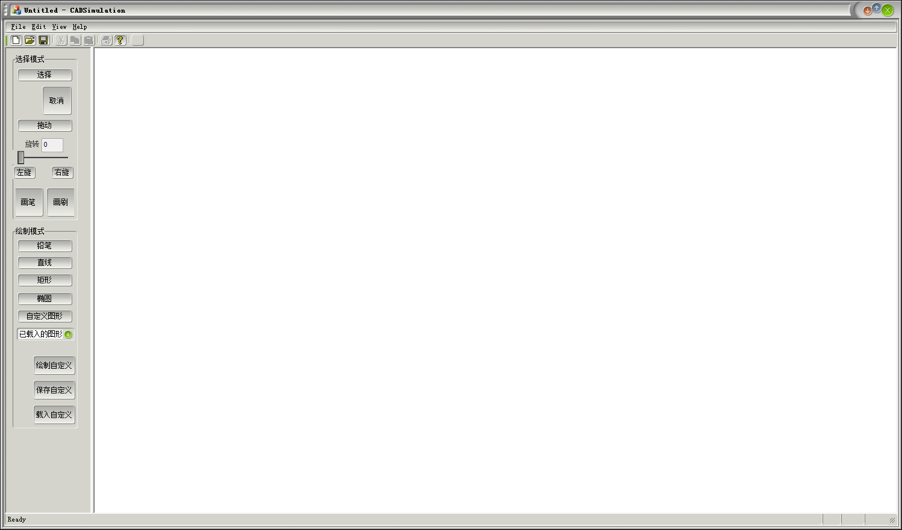

# CAD Rough Imitation

Roughly imitated some of the most popular and less complex functionalities of CAD with MFC.

Video Demo: [Vimeo](https://vimeo.com/435470316)

Executable File Download: [Google Drive](https://drive.google.com/drive/folders/1dk07KtfoTKBSskY8yG6FQj-6Abu5F5Uy?usp=sharing)

Features:
- Pencil, straight line, rectangle, ellipse, border style, color palette, dragging, rotating
- Customized shape drawing, saving and loading
- Canvas saving and loading (MFC serialization)
- Used strategy pattern in design

---

# CAD简单模仿

使用MFC，简单地模仿了CAD软件中的一些最常见的、也易于实现的功能。

演示视频：[BiliBili](https://www.bilibili.com/video/BV1Fx411n7hd/)

可执行文件下载：[蓝奏云](https://wws.lanzous.com/iy0T9ec3frg)

功能：
- 铅笔、直线、矩形、椭圆、边框风格、颜色选择、拖动、旋转
- 自定义图形绘制、保存和载入
- 画布的保存和载入（MFC序列化）
- 使用了策略模式的设计

